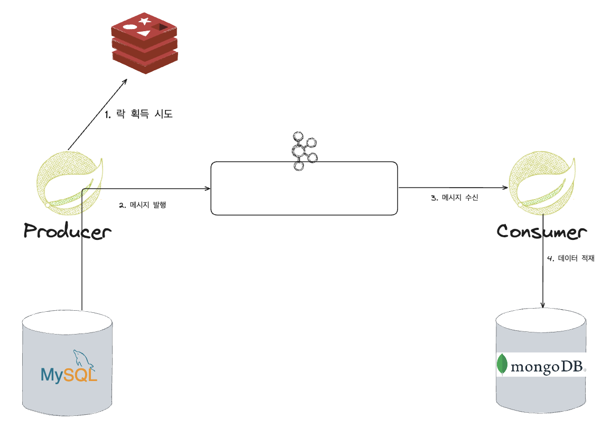

# transactional_outbox_pattern

## 요구사항 가정

- Diary가 삭제될 때 해당 Diary의 정보를 별도의 DB(RDB -> NoSQL)로 이관한다.
- Producer와 Consumer에 Diary를 중복 정의하지 않는다.
- Diary 히스토리는 장애로 인해 유실되어서는 안 된다.

## 삭제 연산 시 구조도



## 참고 커맨드

### mongosh 접속 및 데이터 확인

```
mongosh admin -u root -p root
db.testCollection.find()
```

### kafka topic 초기화 (모든 데이터 제거)

```
/opt/bitnami/kafka/bin/kafka-topics.sh --bootstrap-server localhost:9094 --delete --topic test-topic
```
